  

   

  

## About me

Computer Engineering student at SENAI CIMATEC, based in Salvador, Bahia. I enjoy turning ideas into useful systems and exploring the intersection of AWS, cloud computing, artificial intelligence, web development and solution architecture.

- AWS Golden Student Builder Group Leader and Campus Leader
- Currently building projects with Python, REST APIs, AI and AWS
- Interested in Data/AI, DevOps and Solution Architecture
- Portfolio: [marcostelesdemenezes.vercel.app](https://marcostelesdemenezes.vercel.app/)

## Tech stack

  
  
  
  
  
  
  
  
  
  

## Featured projects

  
  
  
  

## GitHub activity

  
  

  

<picture>
  <source media="(prefers-color-scheme: dark)" srcset="https://raw.githubusercontent.com/MarcosMenezes30/MarcosMenezes30/output/github-contribution-grid-snake-dark.svg" />
  <source media="(prefers-color-scheme: light)" srcset="https://raw.githubusercontent.com/MarcosMenezes30/MarcosMenezes30/output/github-contribution-grid-snake.svg" />
  
</picture>

## Let's connect

  
  

 

  

